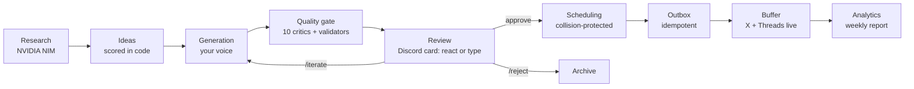

<div align="center">

# Personal Social Publishing OS

**AI does the work. The system enforces the rules. You own the publish button.**

An open-source, production-grade editorial pipeline for **X (Twitter) + Threads**
built on **NVIDIA NIM** (generation), **Buffer** (publishing), **GitHub Actions**
(orchestration), **Discord** (one-click human review — no GitHub account needed)
and **PostgreSQL/Supabase** (state, optional — git-backed SQLite is the default).

`Python 3.10+` · `154 tests, all green` · `MIT license` · `fail-safe OFF by default`

[](https://github.com/ansaribilal14/personal-social-agent/actions/workflows/maintenance.yml)


</div>

---

## Why this exists

Most "AI social media autopilots" quietly turn your account into slop. This
system takes the opposite bet: **AI should do the heavy lifting, but a human
must approve the exact version of everything that goes out** — and the system,
not the model, enforces every rule. Character limits are counted in code, never
by the LLM. Unverified "facts" are rewritten or removed. Publishing is
idempotent: one approved version can never go out twice. A kill switch can
stop everything in one command, and it is checked *immediately before* every
schedule and publish call.

## How it works



1. **Research** — discovers current developments, social signals and evergreen
   material worth commenting on ("what is worth having something to say
   about?", never blind trend-chasing). External content is untrusted data;
   prompt-injection attempts are flagged and quarantined.
2. **Ideas** — generates candidates, scores them in code, applies the
   "Why me?" test, holds weak ones back.
3. **Generation** — writes X singles/threads and Threads posts in your voice,
   with a claim ledger tracking every factual claim to a source.
4. **Quality** — ten editorial critics + deterministic validators + anti-slop
   engine + originality engine compute PASS/FAIL/REVISE. Nothing borderline
   ships.
5. **Review** — approved-by-critics posts become Discord review cards in
   `#social-review`. **Approve with one click (✅ reaction)**, reject with ❌,
   or type `iterate <ID> <instruction>` as a plain message. GitHub issue
   review is optional (off by default in `config/review.yml`).
6. **Publishing** — approved versions go through an idempotent outbox to
   Buffer's (live-verified) GraphQL API with collision-protected scheduling
   (Asia/Kolkata windows), bounded retries and failure alerts to Discord.
7. **Analytics** — append-only metric snapshots from Buffer, sample-size
   guarded, weekly reports. Analytics may recommend; only you decide.

## The rules the system enforces

- No publication without explicit human approval of the exact version.
- There is **no code path** to `APPROVED` except through `WAITING_APPROVAL`
  (proven by tests), and no path to `PUBLISHED` except through `PUBLISHING`.
- Idempotent publishing: one approved version can never publish twice
  (DB-level unique idempotency key).
- The kill switch is re-read from the database immediately before scheduling
  and immediately before publishing. An earlier check is never sufficient.
- The LLM never counts characters — deterministic validators do (X weighted
  length with URLs = 23; Threads 500-char plain count).
- FACT claims require real sources; unverified facts are rewritten or removed.
- Every command, approval and transition is written to an append-only audit
  log.

## Content quality: how generic AI slop is kept out

The writer (prompt `writer_v4`) is contractually a **commentator, not a
summarizer**. Every post must carry a **concrete anchor** (a number, a short
quote, or a named specific taken from the source article) and a **reader
takeaway** (something the reader can repeat, use, or decide). The generation
stage feeds the writer the idea's own source articles - full text when the site
allows it, the feed summary otherwise - instead of a generic pool of headlines.

Deterministic gates (no LLM involved, fully tested) fail a draft that contains:

- meta-labels ("As an opinion:", "Hot take:") or "not X, it's Y" rhetoric
- press-release cadence ("opens a new design space", "paves the way",
  "a new era", "unleashes", "bridges the gap", ...)
- abstract-noun soup (sentences built from landscape/ecosystem/paradigm/journey)
- no concrete anchor at all
- a verbatim copy of any style exemplar from `config/voice.yml`

What still fails goes through a **bounded auto-revision loop**: critic findings
are fed back through the iterator (max `max_revision_cycles`, default 2), and a
post that never passes is `BLOCKED` - junk never loops forever and never
reaches your review queue. Idea selection additionally filters stale research
(`freshness_days_recent`, default 21 days) so the account does not resurrect
old news as if it were fresh.

## Repository layout

```
.github/workflows/   12 composable workflows (research → maintenance)
src/                 domain engines: state machine, security, db, research,
                     strategy, generation, critics, validation, similarity,
                     claims, voice, scheduling, publishing, analytics, review
integrations/        nvidia (NIM), buffer (GraphQL), github, discord (bot +
                     webhooks), supabase
prompts/             versioned prompt library (library.yml)
config/              platforms, strategy, voice, quality, schedule, security
migrations/          PostgreSQL/Supabase schema (23 tables) + SQLite mirror
tests/               154 tests: unit, integration, failure, red-team, e2e
scripts/             CLI entrypoints: run_pipeline.py, run_discord_bot.py,
                     review_comment_handler.py
docs/                architecture, security, operations, testing, audits
```

## Quick start (5 minutes, zero cloud)

```bash
git clone https://github.com/ansaribilal14/personal-social-agent.git
cd personal-social-agent

# Linux/macOS
python3 -m venv .venv && source .venv/bin/activate
pip install -e ".[dev]"
python -m pytest tests/                 # 154 tests, no network needed

# Smoke-run a pipeline stage (AI stages need an NVIDIA_API_KEY, see below)
NVIDIA_API_KEY=nvapi-... python scripts/run_pipeline.py --stage maintenance
```

Everything runs locally on SQLite. For the full autonomous loop you add the
keys below and (recommended) a free Supabase Postgres database.

---

## Full setup guide

### 0. Requirements

- Python **3.10+** (3.12 recommended)
- A GitHub account (Actions + Issues drive the pipeline)
- Free accounts: [NVIDIA](https://build.nvidia.com), [Buffer](https://buffer.com)
  (with your X and/or Threads channels connected), optionally
  [Supabase](https://supabase.com) and [Discord](https://discord.com)

### 1. Clone and install

```bash
git clone https://github.com/ansaribilal14/personal-social-agent.git
cd personal-social-agent
python3 -m venv .venv && source .venv/bin/activate
pip install -e ".[dev,discord]"        # add "postgres" for Supabase
cp .env.example .env                   # fill in what you have; it is gitignored
```

### 2. NVIDIA NIM API key (AI generation)

1. Sign in at **https://build.nvidia.com** with your NVIDIA account.
2. Pick any chat model (e.g. *nemotron-3.5-lightning-30b-a3b*) and click
   **Get API Key** → copy the `nvapi-...` key.
3. Put it in `.env` and/or GitHub Secrets as `NVIDIA_API_KEY`.
4. Optional tuning: `NIM_MODEL` (any model id from build.nvidia.com) and
   `NIM_THINKING` (`false` = default, clean final answers from nemotron
   reasoning models; `true` keeps reasoning, `<think>` blocks are stripped).

> Live-verified 2026-09-07: `meta/llama-3.3-70b-instruct` reached end-of-life
> on NIM; the default model in this repo is verified working.

### 3. Buffer token (publishing to X / Threads)

1. Connect your X / Threads accounts in Buffer normally (buffer.com).
2. Go to **https://buffer.com/developers/applications** → **Create App**.
3. In the app, generate an access token ("Public API token" — this repo uses
   Buffer's current **GraphQL API** at `https://api.buffer.com/graphql`).
4. Put it in `.env` and/or GitHub Secrets as `BUFFER_API_KEY`.
5. Verify: `BUFFER_API_KEY=... python -c "from integrations.buffer.client import BufferClient; print(BufferClient().verify())"`

Notes:
- The adapter maps platform `x` → Buffer service `twitter` automatically.
- Threads are published as ordered posts staggered by
  `BUFFER_THREAD_GAP_SECONDS` (default 90s) — Buffer's current GraphQL schema
  has no reply-chain primitive; content is preserved verbatim.
- Extra channels you connected (e.g. Instagram) are left untouched.

### 4. Discord (review surface + alerts)

The review flow needs **no bot process and no GitHub account**: review cards
are posted to `#social-review`, you approve by reacting ✅ on the card (or
typing `approve <ID>`), and the `discord-approval.yml` Actions workflow picks
decisions up every 5 minutes. A bot token is still required to post as the
bot and read reactions:

1. Go to **https://discord.com/developers/applications** → **New Application**
   → name it (e.g. "Social Automation Bot") → **Bot** tab → **Reset Token**
   → copy it → `DISCORD_BOT_TOKEN`.
2. Privileged intents: leave **Message Content OFF** (reactions + REST only —
   nothing privileged required).
3. Invite it: **OAuth2 → URL Generator** → scopes `bot` +
   `applications.commands`; permissions: Send Messages, Add Reactions, Read
   Message History → open the generated URL and add the bot to your server.
   Template (replace `YOUR_CLIENT_ID` from OAuth2 → Client ID):
   `https://discord.com/oauth2/authorize?client_id=YOUR_CLIENT_ID&permissions=116800&scope=bot+applications.commands`
4. Enable **Developer Mode** in Discord (Settings → Advanced), then right-click
   your server → **Copy Server ID** → `DISCORD_GUILD_ID` (also used to
   authorize the guild owner automatically).
5. Create channels and copy their IDs into the matching env vars:
   `DISCORD_CHANNEL_REVIEW` (review cards), `DISCORD_CHANNEL_ALERTS`,
   `DISCORD_CHANNEL_ANALYTICS`, `DISCORD_CHANNEL_ERRORS`,
   `DISCORD_CHANNEL_GENERAL`, `DISCORD_CHANNEL_STRATEGY`.
6. Authorize reviewers: `DISCORD_AUTHORIZED_USERS=<discord-user-ids-or-usernames>`
   (comma-separated; user IDs are the most reliable). The guild owner is also
   accepted automatically unless `DISCORD_ALLOW_GUILD_OWNER=false`.
7. *(Optional, slash commands only)* run the interactive bot 24/7:
   `python scripts/run_discord_bot.py` (or docker-compose) → first start syncs
   the slash commands instantly (guild mode) and you should see
   `Discord bot logged in as ...`.

### 5. Database (state)

- **Local/dev:** nothing to do — SQLite is used automatically
  (`SQLITE_PATH=data/agent.db` recommended; `:memory:` default).
- **Production (recommended):** create a free Supabase project → Project
  Settings → Database → copy the **session-pooler URI** → `DATABASE_URL` →
  apply the schema once:
  `psycopg2`-enabled install + `python -c "from src.db.connection import get_db, get_postgres_db; ..."`
  or simply run the migration: `psql "$DATABASE_URL" -f migrations/001_init.sql`
  (23 tables, unique idempotency keys, append-only snapshots).

### 6. GitHub Secrets (for the autonomous Actions loop)

Repo → **Settings → Secrets and variables → Actions → New repository secret**:

| Secret | Required for | Example / where to get it |
|---|---|---|
| `NVIDIA_API_KEY` | all AI stages | `nvapi-...` (step 2) |
| `BUFFER_API_KEY` | publishing | Buffer developer token (step 3) |
| `DISCORD_BOT_TOKEN` | Discord bot + notifications | step 4 |
| `DISCORD_GUILD_ID` | instant slash-command sync | step 4 |
| `DISCORD_CHANNEL_REVIEW` | review cards | channel ID (step 4) |
| `DISCORD_CHANNEL_ALERTS` | kill-switch/publish alerts | channel ID |
| `DISCORD_CHANNEL_ANALYTICS` | weekly reports | channel ID |
| `DISCORD_CHANNEL_ERRORS` | publish failures | channel ID |
| `DISCORD_CHANNEL_GENERAL` | fallback notifications | channel ID |
| `DISCORD_CHANNEL_STRATEGY` | strategy reports | channel ID |
| `DATABASE_URL` | shared state across workflows | Supabase URI (step 5) |
| `NIM_MODEL` *(optional)* | model override | default `nvidia/nemotron-3.5-lightning-30b-a3b` |
| `AUTHORIZED_REVIEWERS` *(optional)* | issue-command authz override | default: `config/security.yml` |

> Secrets are never printed, never logged, and never committed. All logging
> goes through a redaction layer (`config/security.yml`).

### 7. First run & verification

```bash
python -m pytest tests/                                        # offline, 154 tests
python scripts/run_pipeline.py --stage maintenance             # self-checks + Buffer verify
python scripts/run_pipeline.py --stage research                # first AI stage (needs NIM key)
```

The maintenance stage verifies your Buffer token against the live GraphQL API
and reports per-integration status: **OK / BLOCKED** with reasons.

### 8. Turn it on (kill switch)

The system ships **fail-safe OFF**: scheduling and publishing are blocked
until you explicitly enable them. In Discord: `/killswitch on` (audited), or
flip the `SOCIAL_AUTOMATION_ENABLED` setting in the DB
(`settings` table) / via the maintenance stage. Turn it off any time with
`/killswitch off` — the switch is re-checked immediately before every
schedule and publish call.

---

## Using the system

### GitHub Actions — the autonomous loop

| Workflow | Trigger | What it does |
|---|---|---|
| `research.yml` | 3× daily + manual | discovers researchable material |
| `idea-discovery.yml` | after research | scores ideas, applies "Why me?" gate |
| `generation.yml` | after ideas | drafts posts in your voice |
| `quality.yml` | after generation | 10 critics + validators, PASS/FAIL/REVISE |
| `review.yml` | after quality | sends Discord review cards (GitHub issues optional) |
| `discord-approval.yml` | every 5 min | reads Discord: ✅/❌ reactions + typed commands → approvals |
| `approval.yml` | `issue_comment` created | processes `/approve` `/reject` on issues (optional surface) |
| `iterate.yml` | after iterate requests | drafts a new version from your instruction |
| `schedule.yml` | periodic | APPROVED → collision-free slots (Asia/Kolkata) |
| `publish.yml` | periodic | outbox → Buffer (idempotent, kill-switch checked) |
| `analytics.yml` | periodic | Buffer metric snapshots (append-only) |
| `weekly-report.yml` | weekly | sample-size-guarded report → Discord |
| `maintenance.yml` | hourly + push | integration verification, self-tests |

### Reviewing on Discord — the default, no GitHub needed

Everything happens in your `#social-review` channel:

**One-click:** react on the review card
- ✅ → approve that exact version
- ❌ → reject it

**Or type a plain message** (leading `/` optional):

```
approve X-2026-AB12C
reject X-2026-AB12C the hook is weak
iterate X-2026-AB12C make it more concrete, cite the benchmark
```

The `discord-approval.yml` workflow polls the channel every 5 minutes, drives
the same audited state machine, and replies with a confirmation. Accepted
`iterate` requests are rewritten immediately and the new version comes back
to review as a fresh card.

Version safety: a ✅ on a card approves **the version printed on that card**;
if the post was iterated since, the reaction is refused with an explanation —
approving v1 never approves v2.

Optional: set `surfaces: [discord, github]` in `config/review.yml` to ALSO get
an audit-trail issue per post with `/approve`-style comments.

**Slash commands** (only when the bot process runs 24/7 via docker-compose):
`/queue` `/show <uid>` `/approve <uid>` `/reject <uid> [reason]`
`/iterate <uid> <instruction>` `/killswitch on|off|status` `/status` `/ping`.

### Local CLI

```bash
python scripts/run_pipeline.py --stage research
python scripts/run_pipeline.py --stage ideas
python scripts/run_pipeline.py --stage generate
python scripts/run_pipeline.py --stage quality
python scripts/run_pipeline.py --stage review
python scripts/run_pipeline.py --stage iterate --post-id 12 --instruction "shorter hook"
python scripts/run_pipeline.py --stage schedule
python scripts/run_pipeline.py --stage publish
python scripts/run_pipeline.py --stage analytics
python scripts/run_pipeline.py --stage weekly-report
python scripts/run_pipeline.py --stage maintenance
python scripts/run_discord_bot.py        # interactive Discord surface
```

## Configuration reference

All knobs live in `config/*.yml` (nothing buried in code):

| File | Controls |
|---|---|
| `config/platforms.yml` | per-platform limits, Buffer service keys, timezone |
| `config/strategy.yml` | pillars, idea scoring weights, "why me" criteria |
| `config/voice.yml` | your voice profile the writer must match |
| `config/quality.yml` | critic thresholds, anti-slop rules, originality gate |
| `config/schedule.yml` | posting windows (Asia/Kolkata), collision gaps, caps |
| `config/security.yml` | kill switch, authorized users, injection defenses |

Environment variables: see **`.env.example`** — every variable is documented
there. Copy to `.env` (gitignored) for local runs, or mirror into GitHub
Secrets for Actions.

## Docker

```bash
cp .env.example .env      # fill in keys
docker compose up -d      # runs the Discord bot with persistent SQLite volume
docker compose run --rm engine python scripts/run_pipeline.py --stage research
```

## Security model (short version; full doc: docs/SECURITY.md)

- **Human approval is the only path to publishing** — enforced by the state
  machine, re-verified immediately before each publish (exact version match).
- **Idempotency at the DB level** — a UNIQUE idempotency key makes
  double-publishing impossible even under races; outbox claiming is atomic.
- **Fail-safe defaults** — kill switch OFF; unreadable DB blocks publishing.
- **Untrusted data everywhere** — research content, comments and command args
  are data, never instructions; injection patterns are flagged and
  quarantined; issue bodies reach workflows only via env (no interpolation).
- **Least privilege** — workflows declare minimal permissions; secrets only
  via env; redaction on every log line.

## Troubleshooting

| Symptom | Cause / fix |
|---|---|
| `buffer auth rejected (HTTP 401)` | wrong/expired token — regenerate (step 3) |
| `no connected Buffer channel for service 'x'` | connect the X account in Buffer, or check `platforms.yml` |
| NIM output contains reasoning text | set `NIM_THINKING=false` (default) or pick a non-reasoning `NIM_MODEL` |
| `HTTP 410` from NIM | model end-of-life — choose a current model on build.nvidia.com |
| Slash commands don't appear | set `DISCORD_GUILD_ID` and restart the bot (instant sync) |
| `Public API tokens are not accepted for REST API access` | you called the legacy REST API; this repo already uses GraphQL at `https://api.buffer.com/graphql` |
| Publishing blocked | expected while kill switch is off — `/killswitch on` |
| `stale approval` in publish | the post was re-drafted after approval — re-approve the new version |

## Adapting it (fork-friendly)

- **Your voice:** edit `config/voice.yml` + `prompts/library.yml`.
- **Your pillars/strategy:** `config/strategy.yml`.
- **Your platforms:** add to `config/platforms.yml` (+ validators in
  `src/validation/`); Buffer channels are discovered automatically.
- **Your reviewers:** `config/security.yml` → `authorized_users` or
  `AUTHORIZED_REVIEWERS` / `DISCORD_AUTHORIZED_USERS` env.
- **Rename it:** it is your engine now — the repo name is only a label.

## Verified live (2026-09-07)

| Integration | Status |
|---|---|
| NVIDIA NIM `nvidia/nemotron-3.5-lightning-30b-a3b` (thinking off) | **LIVE — verified** (clean generation, no reasoning leak) |
| Buffer GraphQL `https://api.buffer.com/graphql` | **LIVE — verified** (identity, 3 channels, draft create/delete probe, metrics shape) |
| Discord bot `Social Automation Bot` | **LIVE — verified** (login + 9 slash commands synced to guild) |
| GitHub Actions review-command intake | verified (REST exercised during setup) |

Details and the full failure taxonomy: [docs/API_COMPATIBILITY.md](docs/API_COMPATIBILITY.md) ·
architecture: [docs/ARCHITECTURE.md](docs/ARCHITECTURE.md) · operations:
[docs/OPERATIONS.md](docs/OPERATIONS.md) · testing:
[docs/TESTING.md](docs/TESTING.md)

## License

[MIT](LICENSE) — fork it, adapt it, run your own engine.
